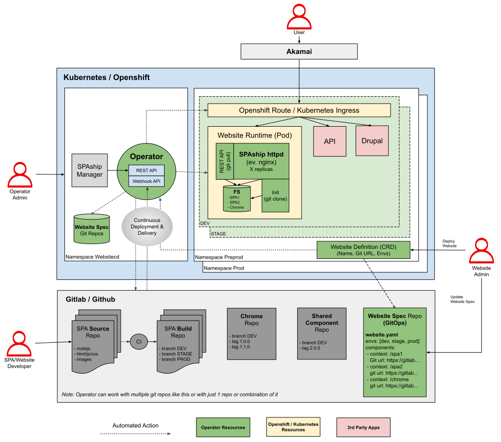

# How It Works

In very similar way how Github pages uses git branches the SPAship Operator works with git repositories and branches and
tags.

Website itself is described in `website.yaml` and stored in git repository. It covers:

1. Environments
2. Components

Once Website administrator registers such git repository the Operator parses `website.yaml` file and deploys each
environment as separate runtime.

## Continuous Deployment & Delivery

Thanks to `/api/webhook` the operator is notified via standard git events about changes in `website.yaml` file as well
as about changes of website's components.

Thanks to such architecture it creates/deletes environments dynamically and offer `continous deployment`. Also performs
incremental updates (via git pull) to offer `continuous delivery`.

## Architecture

Following diagram shows Operator architecture.

